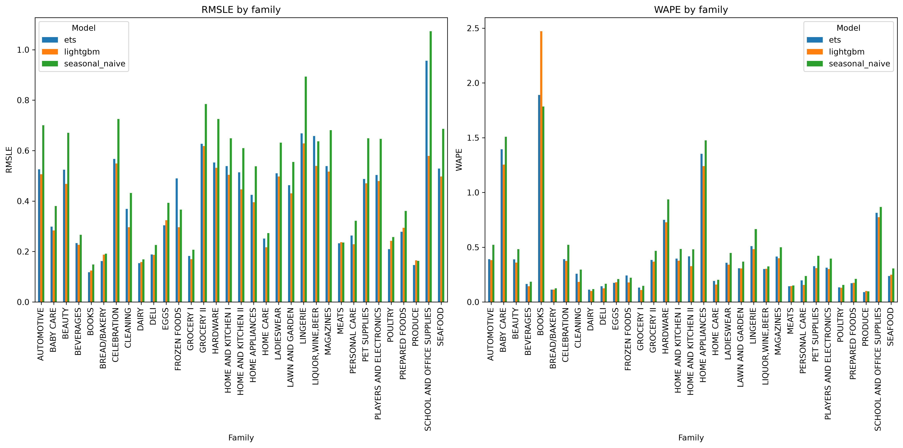
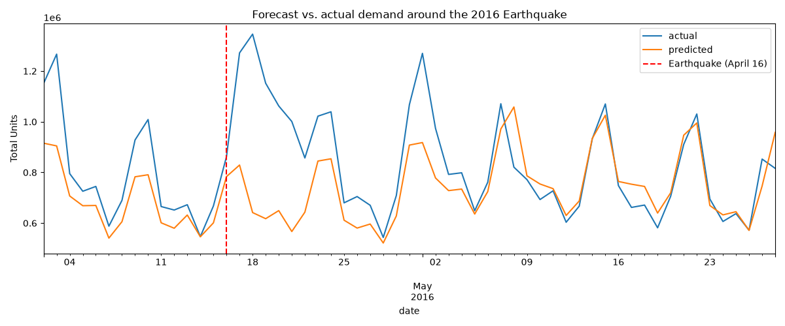

# Favorita Demand Forecasting

[]()

End-to-end retail demand forecasting from raw sales data to a published dashboard that shows where better forecasts save the most money.

DASHBOARD: [Tableau Dashboard](https://public.tableau.com/app/profile/jordan.andersen3718/viz/favorita_demand_forecasting_dashboard/demand_forecast_dashboard?publish=yes) 

#### Data source:

*Kaggle. (2021). Store Sales – Time Series Forecasting [Data set]. Kaggle. https://www.kaggle.com/competitions/store-sales-time-series-forecasting/data*

## Results

**Research Questions:** 

1. How much does LightGBM beat a naive baseline based on the weighted average percent error (WAPE) and root mean squared logarithmic error (RMSLE)?
2. How well does that performance deal with disruptions like the April 2016 Ecuadorian Earthquake?

### Model Results

|Model|RMSLE|WAPE|
|---|---|---|
|seasonal_naive|0.55|0.17|
|ets|0.45|0.15|
|lightgbm|0.40|0.13|

- LightGBM's forecasts improved on the seasonal naive baseline by 27% on the RMSLE score and decreased the WAPE from 17% to 13%.
- The LightGBM model decreases the cost of error by $1,705,506 against the seasonal naive model. 
- Beverages, grocery and produce are the highest cost families for over-forecasting. Forecast improvement efforts should focus on these top categories for the biggest cost saving wins.
- The LightGBM model leans toward underforecasting for both perishable and non-perishable product families, so inventory planners should bias safety stock upward. 



### Disruption Analysis
 
- Coastal regions, who were hit hardest by the earthquake, show a higher WAPE at 37% compared to the inland region's 29%. 
- Product families like home appliances, electronics and baby care show the highest excess demand ratios. This is plausible given that during an earthquake things often break or are damaged within houses, so many people may need to purchase new home appliances or items that may have been damaged during the quake. However, we also know from previous EDA that these are generally low volume units, so I also looked at the difference in true versus predicted values by total units, which shows that grocery, beverages, produce and cleaning were among the families with the highest excess demand in total units, which makes sense after an earthquake that emergency essentials like this would have excess demand compared to that which is forecasted.



## Structure

```
favorita-demand-forecasting/
├── data/
│   ├── raw/          
│   ├── interim/      
│   └── processed/   
├── notebooks/
│   ├── 01-eda.ipynb
│   ├── 02-baselines.ipynb
│   ├── 03-lightgbm.ipynb
│   ├── 04-disruption-analysis.ipynb
│   └── 05-business-impact.ipynb
├── outputs/ 
│   ├── figures/
│   └── results/
├── src/              
│   ├── __init__.py
│   ├── evaluate.py
│   ├── features.py
│   ├── make_dataset.py
│   ├── models.py
│   ├── rolling_origin_cv.py 
│   └── training.py
├── .gitignore
├── requirements.txt
└── README.md
```

### Reproducability

```bash
pip install -r requirements.txt
python src/make_dataset.py

# Then run the notebooks/ in order 01->02->...
```

## Limitations

This project was built to demonstrate an end-to-end forecasting workflow, and some simplifications were made deliberately in the interest of scope and time:

- Cost parameters in notebook 05-business-impact.ipynb are illustrative. The dollar figures in the business-impact analysis (unit margin, holding cost, waste cost, stockout penalty) are reasonable assumptions, not Favorita's actual financials. In a production setting these would come from the company's finance and operations data. The framework is designed to accept real values unchanged, and only the inputs would differ.
- Implicit zeros are treated as true zeros. The source data omits rows for zero-sales days, which conflates "in stock but sold nothing" with "out of stock." Without inventory data, the model cannot distinguish lost demand from genuine zero demand, which may bias forecasts downward for frequently stocked-out items.
- Forecasts are tuned for aggregate, not series level. The model performs well in aggregate (~13% WAPE) but only about a third of individual store x family series forecast within a 20% tolerance. Low-volume, intermittent series remain hard to predict and tuning for these areas is noted in the next steps section.

## Next Steps

### What I'd Do With More Time

- **Hyperparameter optimization:** A systematic search over learning rate, tree depth, and regularization could recover additional accuracy, particularly on the harder mid-volume families.
- **Scale to item level:** The current pipeline runs at the store × product-family grain; the same approach extends to the full item-level Favorita data (~125M rows), where per-SKU forecasting would sharpen the inventory and cost analysis.
- **Dedicated handling for intermittent series:** The low-volume, intermittent series' accuracies would benefit from methods built for sparse demand rather than one global regressor.
- **Stockout-aware modeling:** Incorporating inventory or availability signals would let the model separate true demand from out-of-stock observations and address the implicit-zero limitation above.
- **Probabilistic forecasts:** Moving from point forecasts to prediction intervals would let inventory planners set service levels directly and ensure a proper safety-stock optimization.